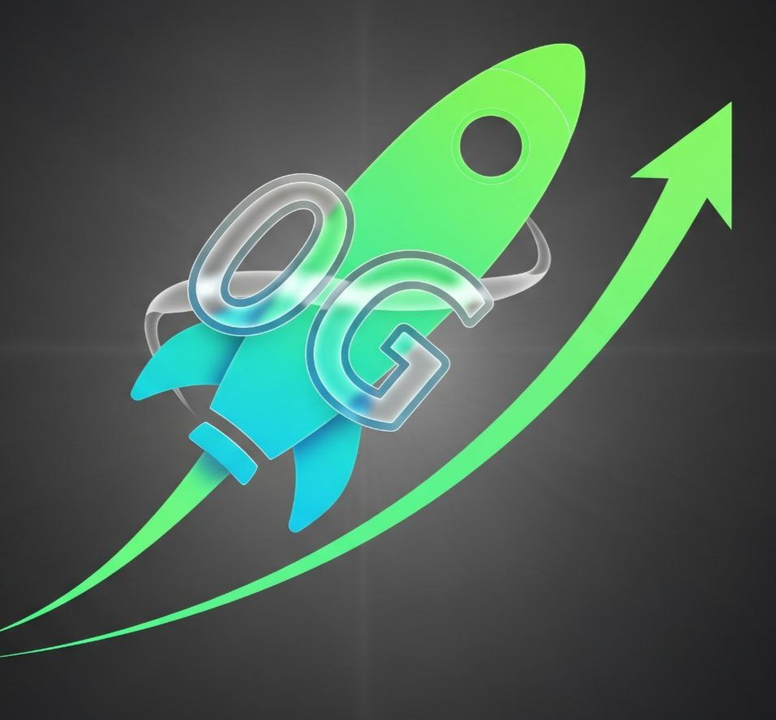

# 🚀 0G Pump - Decentralized Memecoin Trading Platform

A **pump.fun-style** trading platform built on the **0G Chain** ecosystem, featuring instant token creation, bonding curve trading, and decentralized storage integration.



## 🌟 Overview

0G Pump is a comprehensive decentralized trading platform that allows users to create, trade, and discover memecoins on the 0G Chain. Built with modern Web3 technologies, it provides a seamless experience for token creation, trading, and community building.

### ✨ Key Features

- **🎯 Instant Token Creation** - Deploy memecoins with custom names, symbols, and images
- **📈 Bonding Curve Trading** - Trade tokens using advanced bonding curve mechanics
- **💾 0G Storage Integration** - Decentralized storage for images and metadata
- **🔄 Real-time Trading** - Live price updates and instant buy/sell functionality
- **🌐 Multi-wallet Support** - Connect with MetaMask, WalletConnect, and more
- **📱 Responsive Design** - Beautiful UI that works on all devices
- **🔍 Token Discovery** - Search and discover tokens created by the community
- **📊 Trading Analytics** - Real-time market data and trading statistics

## 🏗️ Architecture

### Frontend (Next.js 14)
- **Framework**: Next.js 14 with App Router
- **Styling**: Tailwind CSS with custom components
- **Web3**: Wagmi + RainbowKit for wallet integration
- **Animations**: Framer Motion for smooth interactions
- **UI Components**: Shadcn/ui for accessible design

### Backend (Express.js)
- **API Server**: Express.js with CORS and rate limiting
- **Database**: SQLite for persistent data storage
- **File Upload**: Multer for image handling
- **Blockchain**: Ethers.js for smart contract interaction
- **Storage**: 0G Storage SDK integration

### Smart Contracts
- **Factory Contract**: Token and bonding curve deployment
- **MemeToken**: ERC-20 compatible token implementation
- **BondingCurve**: Advanced AMM with price discovery
- **DEX Integration**: Uniswap V2-style trading pairs

### 0G Ecosystem Integration
- **0G Chain**: High-performance EVM-compatible blockchain
- **0G Storage**: Decentralized storage for images and metadata
- **0G Compute**: Ready for future analytics integration

## 🚀 Quick Start

### Prerequisites
- Node.js 18+ 
- npm or yarn
- MetaMask or compatible Web3 wallet
- 0G Testnet tokens for gas fees

### Installation

1. **Clone the repository**
```bash
   git clone <your-repo-url>
   cd 0gPump
```

2. **Install dependencies**
```bash
npm install --legacy-peer-deps
```

3. **Set up environment variables**

Create `.env.local` for frontend:
```env
NEXT_PUBLIC_EVM_RPC=https://evmrpc-testnet.0g.ai
NEXT_PUBLIC_WALLETCONNECT_PROJECT_ID=your_walletconnect_id
NEXT_PUBLIC_BACKEND_URL=http://localhost:4000
NEXT_PUBLIC_FACTORY_ADDRESS=0x8A1173808F4BF4A35EBb9e6BAFe91E96B2bCc93c
```

Create `.env` for backend:
   ```env
PORT=4000
OG_STORAGE_API=http://localhost:3000
OG_RPC=https://evmrpc-testnet.0g.ai
FACTORY_ADDRESS=0x8A1173808F4BF4A35EBb9e6BAFe91E96B2bCc93c
ROUTER_ADDRESS=0x631b62C792121cE905e73195b6B3a09bd3557a19
DEPLOYER_PRIVATE_KEY=your_0g_testnet_private_key
SYNC_INTERVAL_MS=30000
ENABLE_0G_UPLOADS_ON_CREATE=true
```

4. **Start all services**
```bash
npm run dev:all
```

This will start:
- 0G Storage Kit: http://localhost:3000
- Backend API: http://localhost:4000
- Frontend App: http://localhost:3001

## 📱 Usage Guide

### Creating a Token

1. **Connect your wallet** using the Connect button
2. **Click "Create coin"** in the sidebar
3. **Fill in token details**:
   - Token name (e.g., "DOGEWOW")
   - Token symbol (e.g., "WOW")
   - Total supply (e.g., "1,000,000")
   - Description (optional)
4. **Upload an image** (stored on 0G Storage)
5. **Add social links** (Telegram, X/Twitter, Discord, Website)
6. **Click "Create Token"** and confirm the transaction

### Trading Tokens

1. **Browse available tokens** on the homepage
2. **Click on a token card** to view details
3. **Use the trading interface**:
   - Select buy/sell
   - Enter amount
   - Set slippage tolerance
   - Execute trade
4. **Monitor your portfolio** in real-time

### Token Discovery

- **Search functionality** - Find tokens by name, symbol, or description
- **Real-time updates** - New tokens appear automatically
- **Global sharing** - All tokens are visible to everyone
- **Persistent storage** - Tokens survive server restarts

## 🛠️ Development

### Available Scripts

```bash
# Development
npm run dev              # Start frontend only
npm run dev:backend      # Start backend only
npm run dev:all          # Start all services
npm run dev:kit          # Start 0G storage kit

# Building
npm run build            # Build frontend
npm run build:all        # Build everything
npm run build:optimized  # Build with LIT optimization

# Smart Contract Deployment
npm run deploy:dex:core  # Deploy core DEX contracts
npm run deploy:ogtoken   # Deploy OG token
npm run deploy:curve     # Deploy bonding curve
npm run enable:trading   # Enable trading for tokens

# Automation
npm run setup:automated  # Automated setup
npm run setup:from-storage # Setup from storage data
```

### Project Structure

```
0gPump/
├── app/                    # Next.js app directory
│   ├── components/         # React components
│   ├── api/               # API routes
│   └── page.tsx           # Main page
├── contracts/             # Smart contracts
│   ├── Factory.sol        # Token factory
│   ├── MemeToken.sol      # ERC-20 token
│   ├── BondingCurve.sol   # Trading curve
│   └── DEX/               # Uniswap V2 contracts
├── lib/                   # Utility libraries
│   ├── 0gStorageSDK.ts    # 0G Storage integration
│   ├── bondingCurveTradingService.ts
│   └── newFactoryService.ts
├── scripts/               # Deployment scripts
├── server.js              # Express backend
├── 0g-storage-ts-starter-kit/ # 0G Storage service
└── data/                  # SQLite database
```

## 🔧 Configuration

### Environment Variables

#### Frontend (.env.local)
- `NEXT_PUBLIC_EVM_RPC` - 0G Chain RPC URL
- `NEXT_PUBLIC_WALLETCONNECT_PROJECT_ID` - WalletConnect Project ID
- `NEXT_PUBLIC_BACKEND_URL` - Backend API URL
- `NEXT_PUBLIC_FACTORY_ADDRESS` - Factory contract address

#### Backend (.env)
- `PORT` - Server port (default: 4000)
- `OG_STORAGE_API` - 0G Storage kit URL
- `OG_RPC` - 0G Chain RPC URL
- `FACTORY_ADDRESS` - Factory contract address
- `ROUTER_ADDRESS` - DEX router address
- `DEPLOYER_PRIVATE_KEY` - Backend signer private key
- `SYNC_INTERVAL_MS` - Indexer sync interval

### Database Schema

```sql
CREATE TABLE coins (
  id TEXT PRIMARY KEY,
  name TEXT NOT NULL,
  symbol TEXT NOT NULL,
  supply TEXT NOT NULL,
  imageHash TEXT,
  tokenAddress TEXT,
  curveAddress TEXT,
  txHash TEXT NOT NULL,
  creator TEXT NOT NULL,
  createdAt INTEGER NOT NULL,
  description TEXT,
  telegramUrl TEXT,
  xUrl TEXT,
  discordUrl TEXT,
  websiteUrl TEXT,
  marketCap REAL,
  price REAL,
  volume24h REAL,
  holders INTEGER,
  totalTransactions INTEGER
);
```

## 🌐 Deployment

### Production Deployment

The project consists of three services that need to be deployed:

1. **Frontend** (Vercel/Netlify)
2. **Backend API** (Render/Fly.io/Heroku)
3. **0G Storage Kit** (Node.js hosting)

See [DEPLOY.md](DEPLOY.md) for detailed deployment instructions.

### Docker Support

```bash
# Build and run with Docker Compose
docker-compose up --build
```

## 🔗 API Endpoints

### Coins Management
- `GET /api/coins` - Retrieve all coins
- `POST /api/coins` - Create new coin
- `GET /api/coins/:id` - Get specific coin

### Trading
- `POST /api/enableTrading` - Enable trading for token
- `GET /api/quote` - Get trading quote
- `POST /api/trade` - Execute trade

### Storage
- `POST /api/upload` - Upload image to 0G Storage
- `GET /api/download/:hash` - Download image from storage

## 🧪 Testing

```bash
# Run tests
npm test

# Test storage integration
npm run test:storage

# Test smart contracts
npx hardhat test
```

## 📊 Features in Detail

### Bonding Curve Trading
- **Price Discovery**: Automatic price adjustment based on supply/demand
- **Liquidity Provision**: Initial liquidity seeding with OG tokens
- **Graduation**: Tokens graduate to full DEX when threshold is reached
- **Fee Structure**: Configurable trading fees

### 0G Storage Integration
- **Decentralized Storage**: Images and metadata stored on 0G Storage
- **Content Addressing**: Immutable storage with hash-based addressing
- **Retry Logic**: Robust upload with retry and backoff
- **Caching**: Local caching for improved performance

### Real-time Updates
- **Live Prices**: Real-time price updates from blockchain
- **Auto-refresh**: Automatic data refresh every 30 seconds
- **Event Indexing**: Blockchain event monitoring
- **WebSocket Support**: Real-time notifications (planned)

## 🚧 Roadmap

### Phase 1: Core Platform ✅
- [x] Token creation and deployment
- [x] Bonding curve trading
- [x] 0G Storage integration
- [x] Basic UI/UX

### Phase 2: Enhanced Features 🚧
- [x] Advanced trading interface
- [x] Real-time price updates
- [x] Token discovery and search
- [ ] Portfolio management
- [ ] Trading history

### Phase 3: Advanced Features 📋
- [ ] 0G Compute integration for analytics
- [ ] Advanced charting and technical analysis
- [ ] Social features and community building
- [ ] Mobile app
- [ ] Cross-chain support

## 🤝 Contributing

1. Fork the repository
2. Create a feature branch (`git checkout -b feature/amazing-feature`)
3. Commit your changes (`git commit -m 'Add amazing feature'`)
4. Push to the branch (`git push origin feature/amazing-feature`)
5. Open a Pull Request

## 📄 License

This project is licensed under the MIT License - see the [LICENSE](LICENSE) file for details.

## 🙏 Acknowledgments

- **0G Labs** - For the amazing 0G Chain infrastructure
- **RainbowKit** - For beautiful wallet connection UI
- **Shadcn/ui** - For accessible, beautiful components
- **Next.js Team** - For the excellent React framework
- **Ethers.js** - For robust blockchain interaction

## 📞 Support

- **GitHub Issues** - Report bugs and request features
- **Documentation** - Comprehensive guides and API docs
- **Community** - Join our Discord for help and discussion

## 🔗 Links

- **0G Chain Explorer**: https://chainscan-galileo.0g.ai
- **0G Testnet RPC**: https://evmrpc-testnet.0g.ai
- **0G Documentation**: https://docs.0g.ai
- **Project Demo**: [Live Demo URL]

---

**Built with ❤️ for the 0G ecosystem**

*Images and metadata are stored on 0G Storage; no fake placeholder data is shown. All trading data is real and on-chain.*